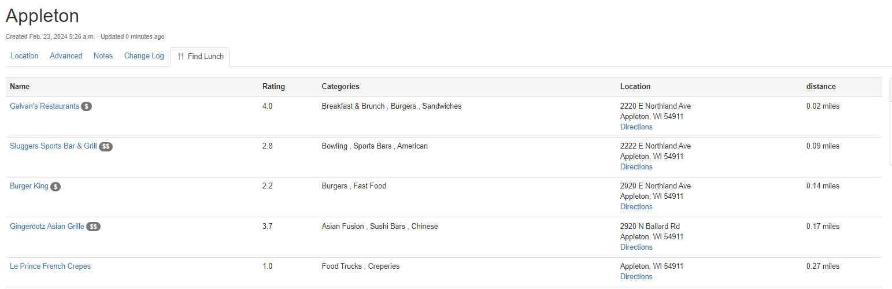

# Using the App

This document describes common use-cases and scenarios for this App.

## General Usage

## Use-cases and common workflows

Go to a location with either the latitude/longitude set or the physical address. Click on the `🍴 Find Lunch` tab.

## Screenshots

